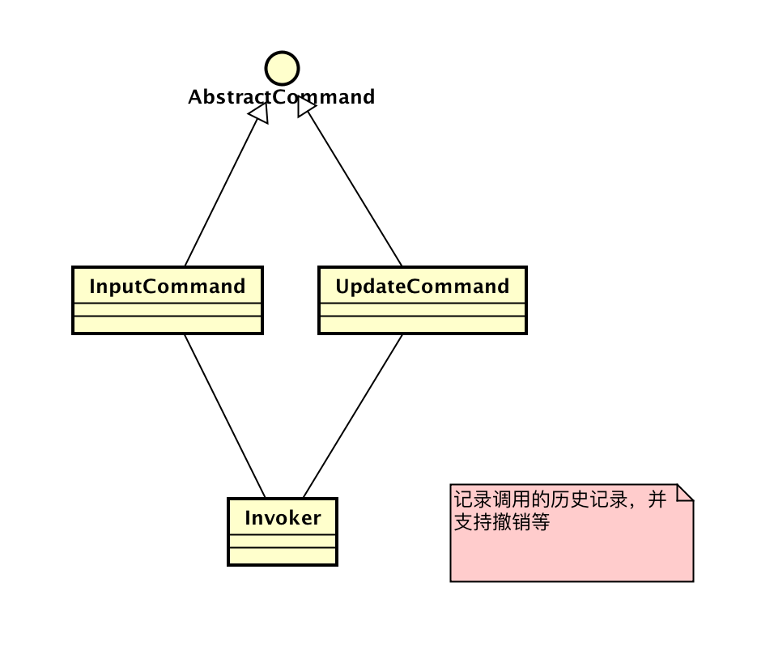
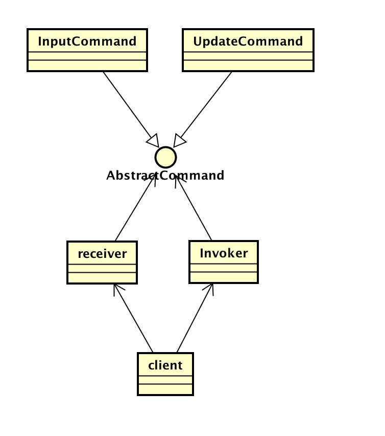
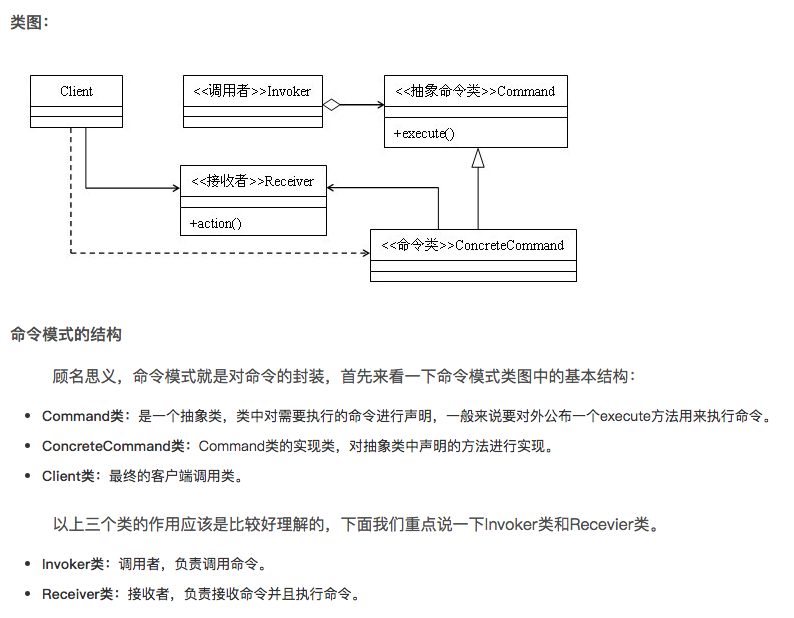

---
layout: post
title: 命令模式推导及应用场景浅析
description: 命令模式
category: 设计模式
tags: [设计模式, 命令模式]
---

## 序
前阵子在做一个东西时，用到了命令模式的变种，当时有些细节记不清了，于是去网上找了一些资料，结果越看越迷糊。最后索性自己重新推导了一次，在对推导过程作记录后，就有了这篇文章。

## 问题
使用word时，如果做错了某步操作，我们可以进行”撤销”,恢复到操作之前的状态。尽管每种操作都不一样，但是却神奇地能用同样的方式“撤销”。这是怎么做到的呢？

## 解决方案
从上面的描述，我们可以知道，word能做到这些功能:
* 以同样的方式表示所有可以撤销的操作
* 记录所有可以撤销的操作

由此，可以得到以下结构:



仔细看看，好像有个问题: 命令的定义应该是通用的，如输入一段文字，但是我们撤消的是在某个地方输入的一段文字，所以还要加上命令执行的上下文，这里我们用Receiver来指代。更新后的类图:



## 模式的理解
要理解命令模式，除了从它的应用场景推导之外，也可以从它的定义帮助理解:
```
命令一般应用于政府机构中。当某政府首脑发出命令时，一般不会由该首脑直接面对执行的人，而是通过类似国务院等机构发出。这里的国务院等机构就是命令模式里的Invoker，负责记录和执行。

命令里，一般会说清楚，要谁来做什么，所以，事实上命令(这里的命令不同于上面类图里的command)是由receiver和command两部分组成。

每过一段时间，都有人事上的一些变动，为第一次人事变动，都创建一种命令模板是不可能的，于是，政府对于主要的命令都规则了一个模板，每次需要的时间，只要把对应的人和职位变动内容填上去就可以了，这就是我们的command。
```

## 命令模式的类图
这部分网上的资料很多，我就不重复写了，以下内容摘自[博客](https://blog.csdn.net/zhengzhb/article/details/7550895)



## 适合场景与优缺点
命令模式有以下优点:
1. 命令和实际的执行者分离，实际的操作都是通过invoker以及receiver去执行的
2. 屏蔽了底层的复杂实现，对外提供了统一的表现
3. 可以记录操作的历史记录
4. 拓展性好，一方面，可以很方便地添加新的命令，如在word中添加插入html功能；另一方面，也可以把命令迁移到另一种场景下，如把word中的命令迁移到excel中
5. 用户使用上，用户通过组合一些命令，可以实现宏的功能，效率更高

缺点:
* 代码冗余较多。每个命令，需要同时修改好几个地方，维护较复杂

由其优缺点，可以得出其适用场景:
* 编辑软件，如word,excel中，但是由于撤销依赖于当前状态，所以如果应用的状态无法完整保存，那么不应该提供撤销功能
* 由第一点，可以用于workflow、oa系统等软件中，用于定义流程、功能节点
* 由第三点，可以用于需要审计的系统中，用于审计
* shell中，用于对资源进行封装
* 第五点在很多文本编辑器中都有体现

不适用的场景:
* 功能足够简单。如果功能本身比较简单，则不建议引入命令模式，它会带来更多的复杂性，以及更高的开发成本
* 命令的意义不清晰或经常变化。命令模式在解耦命令的发出者与执行者的同时，也让命令发出者与执行者的联系不那么清晰，如果修改了命令的意义，要全面修改命令的调用者，会比较难


